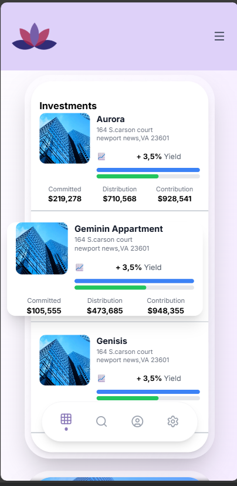
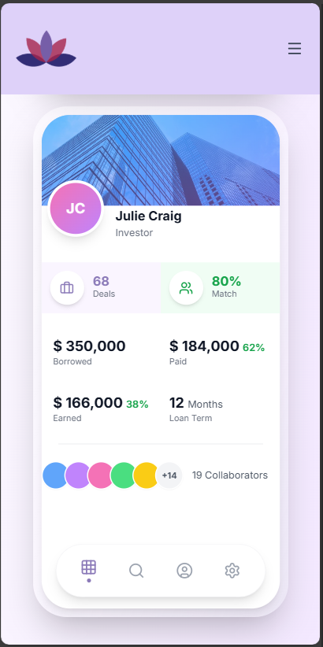
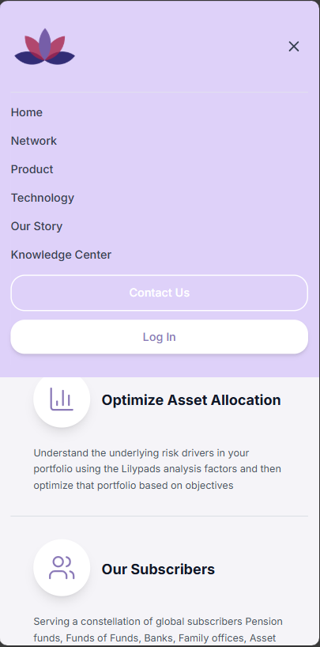
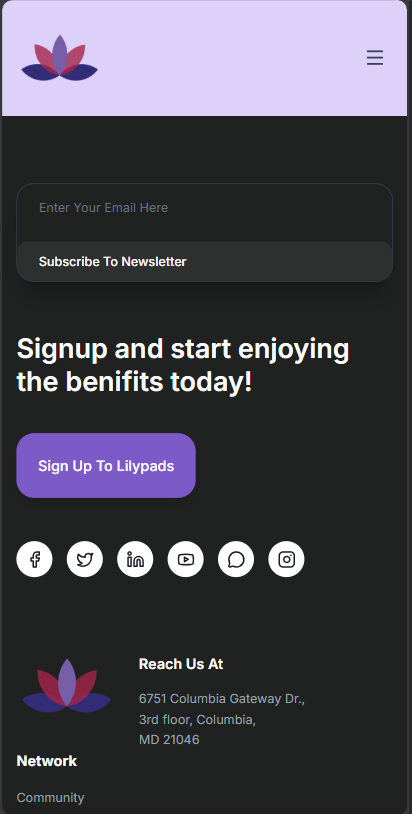

## A modern, responsive ui for lilypads

## 📸 Screenshots

### Desktop View 


### Mobile View
<p>
  
  
  
  <br><br>
  
  
  
</p>


## 🛠️ Tech Stack

### Frontend
- React 18
- Vite
- Tailwind CSS


### Frontend Setup

1. Navigate to folder and install dependencies:
```bash
npm install
```

2. Start the development server:
```bash
npm run dev
```

Frontend runs on: `http://localhost:5173`

